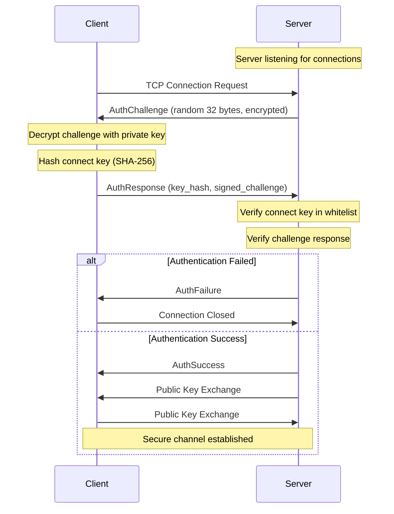
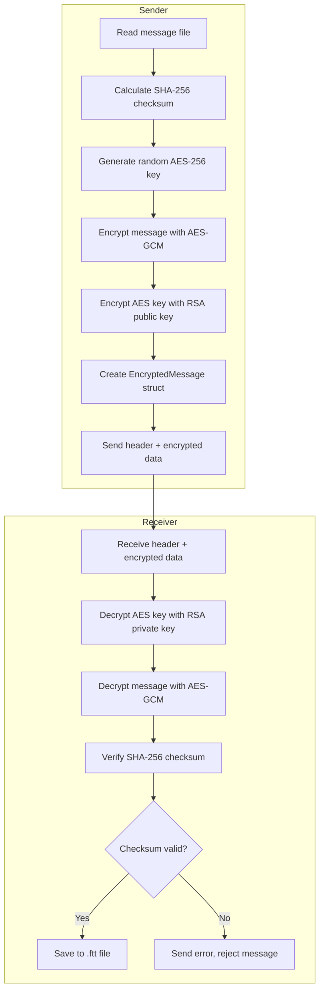

# Secure Finance Messaging Block Application

A secure, encrypted messaging system for financial institutions to exchange message blocks between servers with RSA + AES hybrid encryption and token-based authentication.

**Author: [sweetrush](https://github.com/sweetrush)**

## Overview

This application enables two servers to securely share message blocks with each other. Before any message exchange, servers authenticate using a challenge-response mechanism with connect keys. All messages are encrypted using a hybrid encryption scheme (RSA-2048 + AES-256-GCM) ensuring confidentiality and integrity.

## Architecture

### Directory Structure

```
stl_finapp/
├── Cargo.toml              # Project manifest and dependencies
├── README.md               # This file
├── keys/                   # Default directory for RSA key pairs
│   ├── private_key.pem     # RSA private key (keep secure!)
│   ├── public_key.pem      # RSA public key (share with peers)
│   └── whitelist.txt       # Allowed connect keys
├── messages/               # Default directory for received messages
├── src/
│   ├── main.rs             # Application entry point
│   ├── lib.rs              # Library exports
│   ├── error.rs            # Custom error types
│   ├── cli/
│   │   ├── mod.rs          # CLI module
│   │   ├── args.rs         # Command-line argument definitions
│   │   └── output.rs       # Colored terminal output utilities
│   ├── crypto/
│   │   ├── mod.rs          # Crypto module
│   │   ├── keys.rs         # RSA key pair generation/management
│   │   └── encryption.rs   # Hybrid encryption (RSA + AES)
│   ├── auth/
│   │   ├── mod.rs          # Auth module
│   │   ├── token.rs        # Authentication tokens
│   │   └── whitelist.rs    # Connect key whitelist management
│   ├── protocol/
│   │   ├── mod.rs          # Protocol module
│   │   ├── message.rs      # Message types and structures
│   │   └── handshake.rs    # Authentication handshake protocol
│   ├── server/
│   │   ├── mod.rs          # Server module
│   │   ├── listener.rs     # TCP listener implementation
│   │   └── handler.rs      # Connection handler
│   ├── client/
│   │   ├── mod.rs          # Client module
│   │   └── sender.rs       # Message sender implementation
│   └── interactive/
│       ├── mod.rs          # Interactive module
│       └── session.rs      # REPL interactive session
└── target/                 # Build artifacts
```

### Module Overview

| Module | Description |
|--------|-------------|
| `cli` | Command-line interface with colored output and argument parsing |
| `crypto` | Cryptographic operations: RSA key generation, AES-GCM encryption |
| `auth` | Authentication: tokens, connect key hashing, whitelist management |
| `protocol` | Network protocol: message types, handshake flow, serialization |
| `server` | TCP server: accepts connections, handles authentication, receives messages |
| `client` | TCP client: connects to servers, authenticates, sends messages |
| `interactive` | REPL mode for interactive usage |

## Security & Protocol

### Encryption Model

The application uses **hybrid encryption** combining RSA and AES:

1. **RSA-2048** for key exchange and digital signatures
2. **AES-256-GCM** for symmetric message encryption

This approach provides:
- Confidentiality through AES-256-GCM encryption
- Integrity verification via GCM authentication
- Secure key exchange via RSA encryption

### Authentication Handshake Flow



### Message Encryption/Decryption Flow



## Features

- **Hybrid Encryption**: RSA-2048 + AES-256-GCM for secure message exchange
- **Token-Based Authentication**: Challenge-response authentication with connect keys
- **Whitelist Access Control**: Server-side whitelist for authorized connect keys
- **Integrity Verification**: SHA-256 checksums for all messages
- **Interactive Mode**: REPL interface for convenient operation
- **Colored CLI Output**: Clear, color-coded terminal messages
- **Graceful Shutdown**: Ctrl+C handling for clean server termination
- **Auto Key Generation**: Automatic key pair generation on first run
- **Message Timestamping**: Received files include timestamps in filenames

## Installation & Setup

### Prerequisites

- Rust 1.70 or later
- Cargo package manager

### Build

```bash
# Clone or navigate to the project
cd stl_finapp

# Build in release mode
cargo build --release

# The binary will be at target/release/stl_finapp
```

### Key Management

```bash
# Generate new RSA key pair (saved to keys/ directory by default)
./stl_finapp keygen

# Generate keys to a specific directory
./stl_finapp keygen --output /path/to/keys

# Add a connect key to the whitelist
./stl_finapp whitelist --ck "your-secret-connect-key"
```

### Server Setup

```bash
# Start server on default port (8080)
./stl_finapp listen

# Start server on a specific port
./stl_finapp listen --port 9000

# Use custom whitelist and keys directories
./stl_finapp listen --port 8080 --whitelist /path/to/whitelist.txt --keys /path/to/keys
```

### Client Usage

```bash
# Send a message file
./stl_finapp send --ip 192.168.1.100 --port 8080 --file message.txt --ck "your-connect-key"

# Send with a custom filename for the receiver
./stl_finapp send -i 192.168.1.100 -p 8080 -f message.txt --ck "your-connect-key" -s "important_message"
```

### Interactive Mode

```bash
# Start interactive mode
./stl_finapp -m
# or
./stl_finapp --interactive
```

## Usage Examples

### Example 1: Basic Two-Server Setup

**Server A (192.168.1.100):**
```bash
# Generate keys
./stl_finapp keygen

# Add Server B's connect key to whitelist
./stl_finapp whitelist --ck "server-b-secret-key"

# Start listening
./stl_finapp listen --port 8080
```

**Server B (192.168.1.101):**
```bash
# Generate keys
./stl_finapp keygen

# Send a message to Server A
./stl_finapp send --ip 192.168.1.100 --port 8080 \
    --file financial_report.txt \
    --ck "server-b-secret-key" \
    --save-as "q1_report"
```

### Example 2: Interactive Mode Session

```
$ ./stl_finapp -m

Secure Finance Messaging Application
──────────────────────────────────────────────────────────
[?] Type 'help' for available commands
[INFO] Loaded keys from keys

finapp> listen 8080
[-] Listening on 0.0.0.0:8080
[SUCCESS] Server started on port 8080
[?] Press Ctrl+C to stop the server

finapp> status

Current Status
──────────────────────────────────────────────────────────
  Server: Listening on port 8080
  Keys: Loaded from keys

finapp> send 192.168.1.100 message.txt report
Enter connect key: ********
[*] Connecting to 192.168.1.100:8080...
[*] Authenticating...
[+] Authentication successful
[INFO] Sending file: report (1024 bytes)
[*] Encrypting message...
[*] Sending 1248 bytes...
[SUCCESS] Message delivered, saved as: report_20240214_120000.ftt

finapp> stop
[INFO] Server stopped

finapp> exit
[INFO] Goodbye!
```

## CLI Reference

### Subcommands

| Command | Description |
|---------|-------------|
| `listen` | Start the server in listening mode |
| `send` | Send a message to a server |
| `keygen` | Generate new RSA key pair |
| `whitelist` | Add a connect key to whitelist |

### `listen` Command Options

| Option | Short | Default | Description |
|--------|-------|---------|-------------|
| `--port` | `-p` | 8080 | Port to listen on |
| `--whitelist` | `-w` | keys/whitelist.txt | Path to whitelist file |
| `--keys` | `-k` | keys | Path to keys directory |

### `send` Command Options

| Option | Short | Default | Description |
|--------|-------|---------|-------------|
| `--ip` | `-i` | (required) | Server IP address |
| `--port` | `-p` | 8080 | Server port |
| `--file` | `-f` | (required) | Message file path |
| `--ck` | | (required) | Connect key for authentication |
| `--save-as` | `-s` | (original filename) | Remote filename |
| `--keys` | `-k` | keys | Path to keys directory |

### `keygen` Command Options

| Option | Short | Default | Description |
|--------|-------|---------|-------------|
| `--output` | `-o` | keys | Output directory for keys |

### `whitelist` Command Options

| Option | Short | Default | Description |
|--------|-------|---------|-------------|
| `--ck` | | (required) | Connect key to add |
| `--file` | `-f` | keys/whitelist.txt | Whitelist file path |

### Legacy Shorthand Options

For backward compatibility, these shorthand options are available:

| Option | Description |
|--------|-------------|
| `-i, --ip <IP>` | Server IP (shorthand mode) |
| `-f, --file <FILE>` | Message file (shorthand mode) |
| `-s, --save-as <NAME>` | Save filename (shorthand mode) |
| `-m, --interactive` | Start interactive mode |
| `--ck <KEY>` | Connect key (shorthand mode) |
| `--lp <PORT>` | Listening port (shorthand mode) |

### Interactive Mode Commands

| Command | Short | Description |
|---------|-------|-------------|
| `listen [port]` | `l` | Start server (default: 8080) |
| `stop` | | Stop the listening server |
| `send <ip> <file> [name]` | `s` | Send message to server |
| `status` | | Show current status |
| `keygen [dir]` | `k` | Generate new key pair |
| `whitelist <key>` | `w` | Add key to whitelist |
| `help` | `h`, `?` | Show help message |
| `exit`, `quit` | `q` | Exit interactive mode |

## Security Considerations

### Cryptographic Details

| Component | Algorithm | Key Size |
|-----------|-----------|----------|
| Asymmetric Encryption | RSA with PKCS#1 v1.5 padding | 2048 bits |
| Symmetric Encryption | AES-256-GCM | 256 bits |
| Key Hashing | SHA-256 | 256 bits |
| Challenge Size | Random bytes | 32 bytes |
| Nonce (AES-GCM) | Random bytes | 96 bits |

### Best Practices

1. **Private Key Security**
   - Private keys are saved with 0600 permissions (Unix)
   - Never transmit private keys over the network
   - Store keys in a secure, access-controlled location

2. **Connect Key Management**
   - Use strong, unique connect keys for each peer
   - Regularly rotate connect keys
   - Connect keys are stored as SHA-256 hashes

3. **Network Security**
   - The application encrypts data end-to-end
   - Consider running behind a firewall
   - Use VPN for additional network-layer security

4. **Message Integrity**
   - All messages include SHA-256 checksums
   - Checksums are verified before accepting messages
   - Failed checksums result in message rejection

### Known Limitations

- RSA-2048 limits direct encryption to 190 bytes (hence hybrid encryption)
- No built-in key rotation mechanism
- Connect keys stored in plaintext in whitelist file (hashed for transmission)
- No certificate-based authentication

## Dependencies

| Crate | Version | Purpose |
|-------|---------|---------|
| `clap` | 4.4 | CLI argument parsing with derive macros |
| `tokio` | 1.35 | Async runtime |
| `rsa` | 0.9 | RSA encryption/decryption |
| `aes-gcm` | 0.10 | AES-GCM symmetric encryption |
| `sha2` | 0.10 | SHA-256 hashing |
| `rand` | 0.8 | Cryptographically secure RNG |
| `serde` | 1.0 | Serialization framework |
| `bincode` | 1.3 | Binary serialization |
| `colored` | 2.1 | Terminal coloring |
| `chrono` | 0.4 | Date/time handling |
| `thiserror` | 1.0 | Custom error derive |
| `anyhow` | 1.0 | Error handling |

## License

This project is proprietary software for secure financial messaging.

## Contributing

When contributing, please:
1. Follow Rust best practices and idioms
2. Add tests for new functionality
3. Update documentation as needed
4. Ensure `cargo clippy` passes without warnings
